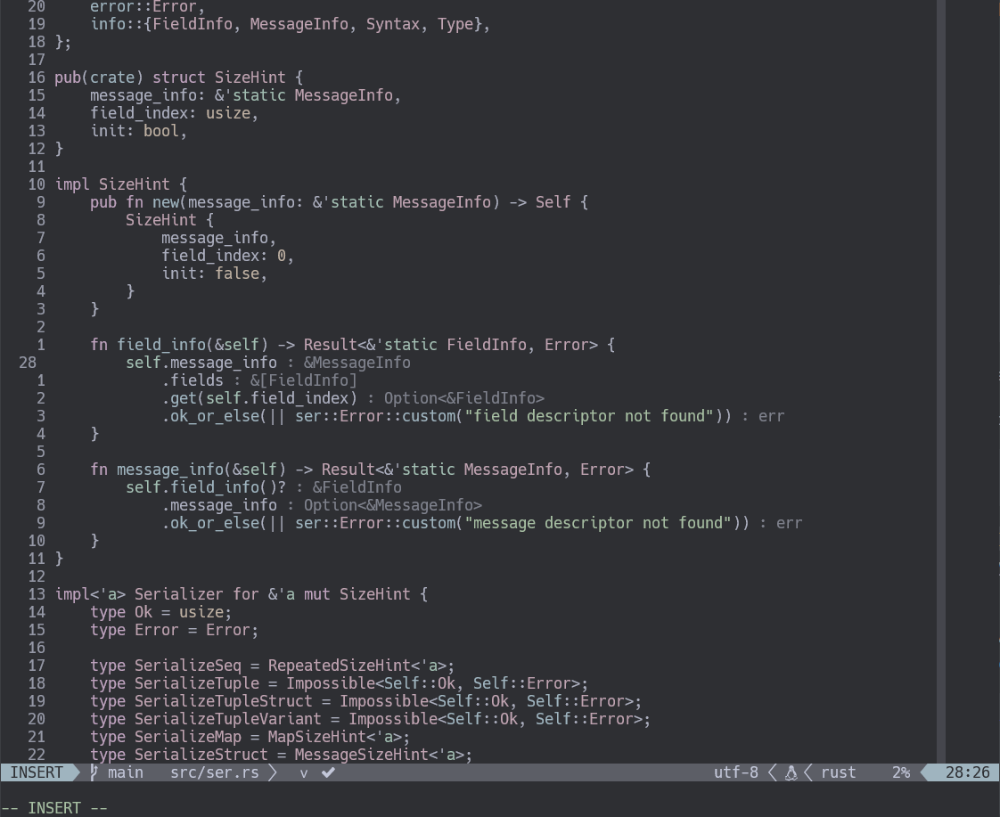

# ajguerrer/stonerose 

stoenrose is a modern colorscheme written in lua for NeoVim that supports new features added to 
NeoVim like built-in LSP and [TreeSitter](https://github.com/nvim-treesitter/nvim-treesitter)



## ⚡️ Requirements

+ Neovim >= 0.5.0

## 🌙 Installation

Install via your favourite package manager:
```vim
" If you are using Vim-Plug
Plug 'ajguerrer/stonerose'
```

```lua
-- If you are using Packer
use 'ajguerrer/stonerose'
```

## 🌓 Usage

Enable the colorscheme:
```vim 
"Vim-Script:
colorscheme stonerose
```

```lua
--Lua:
require('stonerose').set()
```

To enable the `stonerose` theme for `Lualine`, simply specify it in your lualine settings:

```lua
require('lualine').setup {
  options = {
    -- ... your lualine config
    theme = 'stonerose'
    -- ... your lualine config
  }
}
```
